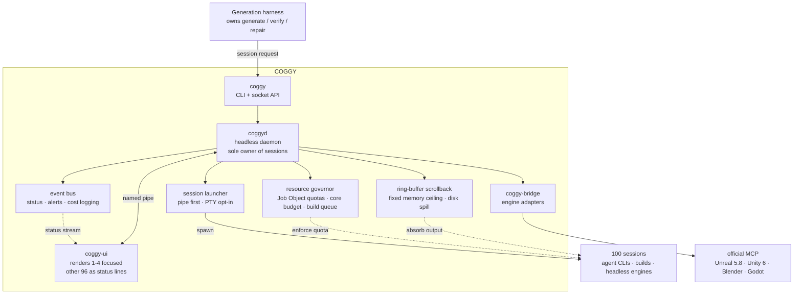

# COGGY PLAN

> COGGS builds games. COGGY decides **how many it can build at once.**

**This document owns what is true about COGGY: architecture, scope, constraints, and the decisions behind them.** [README](../README.md#documentation) maps the rest.

Claims are marked. **[measured]** is a number we took ourselves; **[assumed]** is an untested belief, and each is a falsifiable axis in `sessionbench` rather than a premise. An assumption quietly designed around becomes indistinguishable from a fact.

## Why this exists

The old harness took roughly 1–2 wall-clock hours per game. Working backward from 1000 games a day:

```
1000 games/day ÷ 24h × 1.5h/game = ~63 concurrent sessions
plus headroom for failure, retry, and repair = 100 concurrent sessions
```

**[assumed]** Those per-game figures came from a harness we are replacing. They are planning inputs, not facts, and nothing in the codebase encodes them. M2 remeasures against the new harness and supersedes them.

The bottleneck is neither CPU nor RAM in the usual sense. It is **what 100 simultaneous sessions cost while they are alive.** On stock Windows 11 Terminal with pwsh 7 that means:

- **[assumed]** 100 shell processes plus the 100 conhost processes ConPTY attaches — 200 processes resident for hours, not moments
- **[assumed]** Defender real-time scanning every file the sessions write, continuously, for as long as they run
- **[assumed]** 100 output streams to absorb without dropping any
- **[assumed]** a single UI thread managing a 100-cell grid, once a UI exists

**[measured]** Windows Terminal is already C++ with a GPU renderer, so the lag is not a language problem.

### Residency, not spawning

It is tempting to blame process creation — pwsh profile autoload alone runs 300–700ms, so starting 100 shells costs about a minute. **That minute is a red herring**, and the arithmetic above is what exposes it:

```
1000 spawns/day × 1s each  =     1,000 s/day
1500 session-hours/day     = 5,400,000 s/day
                    spawn  =        0.02%
```

Three retries per game and five seconds per spawn still leaves spawn under 0.3%. The one-minute figure is a **cold start** — it happens when the daemon boots, not once per game. In steady state a session is replaced roughly every 86 seconds, and the machine spends the remaining 99.98% of its time *holding* sessions rather than starting them.

So COGGY's goal is not a faster terminal, and not faster process creation either. It is **not paying for 200 resident processes and their I/O for hours at a time.**

**[assumed]** Which of the residency costs actually dominates is what `sessionbench` decides, and the redline conditions are weighted accordingly. If the answer lands outside them, [Architecture](#architecture) gets rewritten before any daemon work starts.

### The instrument and the metric

**`sessionbench`** is the one tool that exists today. It stays a standalone benchmark rather than folding into a `coggy` subcommand — [the naming rules](#name-coggy-settled) explain why the measuring tool must not wear the product's name.

**`redline`** is the single number it produces. Exactly as an engine's redline is the speed past which it comes apart, this is **the maximum number of concurrent sessions a machine sustains.**

> "This machine's redline is 84 sessions."

A benchmark gets cited for one sentence like that, so a fuzzy metric sinks it whatever the name. The four conditions that make it precise, the ramp procedure, and the axes it plots are defined in [sessionbench/README.md](../sessionbench/README.md).

### How this came about

paperthin was built because carving the Daedal wiki and harness required it. COGGY is the same: not built to sell, built because the main build was blocked. Keeping that order yields the strongest narrative in the devtool category for free. cmux and orca followed exactly this path.

---

## Name: COGGY (settled)

COGGY is the COGGS engine's child name. If the engine is a factory, COGGY is its floor supervisor. It sits in the same child line as PING, the mascot.

### Availability (checked 2026-07-30)

| Surface | Status |
|---|---|
| npm `coggy` | unregistered |
| crates.io `coggy` | unregistered |
| PyPI `coggy` | unregistered |
| npm / crates.io `sessionbench` | both unregistered — the benchmark |
| `redline` | taken on npm; crates.io holds a dormant 0.0.1 from 2020-10-24 ("Redis serialization protocol"), never updated. Irrelevant: it names a metric, not a package |
| coggy.dev / .sh / .io / .app / .gg / .games / .tools / .build | all unregistered |
| coggy.com | registered since 2005, presumed parked |
| GitHub user `coggy` | taken by an individual; unusable as an org handle |
| GitHub repo name `coggy` | six same-named repos, all 0–1 stars and dormant |

**Actions:** register `coggy.dev` and `coggy.sh`; reserve the npm and PyPI names. The repo is `DaedalGames/coggy`. We give up the GitHub user handle and go through the org path. `.com` is a negotiation, not a blocker.

**We reserve no name anywhere — not `coggy`, not `sessionbench`.** An empty 0.0.0 placeholder answers "what is this?" wrongly for years, and crates.io has no real unpublish. Names get claimed when something real ships. The accepted risk is that `sessionbench` is free today and may not be later.

Separately, and for a different reason: because of [the linking boundary](#the-linking-boundary), COGGY will never publish a linkable **core** crate at all. `sessionbench` is a benchmark, so that rule does not reach it.

### Naming the benchmark: `sessionbench`

Tagline, and the only place the Windows constraint is advertised: *The concurrent session scaling benchmark for Windows-native terminals.*

Five rules produced it. Each rejected a candidate someone will propose again.

1. **Tools are named descriptively, metrics evocatively.** A tool is where a stranger lands after searching a problem; a metric gets embedded in a sentence and has to stick. Surviving benchmark names are near-uniformly descriptive — vtebench, termbench, SWE-bench, LiveCodeBench — while the evocative ones, hyperfine and typometer, are instruments rather than benchmarks.
2. **No product prefix.** vtebench is the Alacritty team's and is not `alacritty-bench`; termbench-pro is Contour's and is not `contour-bench`. A benchmark wearing its parent's name gets discounted the moment it publishes a table the parent wins. Same integrity concern as the comparison set and anti-tuning rules in [ROADMAP.md](../ROADMAP.md).
3. **Lowercase kebab only.** crates.io and npm have effectively no PascalCase, and people type lowercase however it is registered. `Win`-prefixed PascalCase also reads as WinDbg/WinSCP-era shareware, and WinBench was a real Ziff-Davis product.
4. **No platform in the name.** Windows constrains developer machines running editors, but headless batches may move to a Linux farm, where Godot and Blender both run. A product may carry its platform; a measurement standard that does cannot follow the work. The tagline carries that signal instead.
5. **No unproven hypothesis in the name.** `conpty-bench` was the strongest candidate — unmistakable, implicitly Windows, instantly recognizable to anyone who has hit it. But M0 has not established whether the bottleneck is ConPTY, process creation, or Defender, and if it is Defender the name is permanently wrong. **Name it for what is measured; let the report name the cause.** Concurrent sessions are what we measure whatever the outcome; ConPTY is only who we suspect.

Also rejected: `tach` and `coggy-tach` (rules 1 and 2, and `redline` already holds the metric slot), `WinSessionBench` (rules 3, 4), `win-session-rpm-bench` (in devtools "rpm" reads as RedHat Package Manager), `termscale` (reads as font/DPI scaling), `winsession` (does not say benchmark), `winbench` (collides with Ziff-Davis). If a Windows signal ever becomes mandatory in the name itself, the fallback is `winsessionbench` — long, but it breaks no rule.

**The name is frozen.** Only two things justify renaming: `sessionbench` being taken upstream, or a change in what we measure, since a different axis is a different tool. A better-sounding idea, brand tidiness, or the urge to prefix are not justifications — rules 1–5 already ruled on those.

---

## Scope boundary (what this is not)

Lose this boundary and you die building an IDE.

- **Not an editor.** It does not edit code. Agents write files.
- **Not an agent.** It never calls a model. It runs Claude Code, Codex, and the generation harness as-is.
- **Not the generation harness.** Generation contracts, proof idioms, and double verification belong to the harness. COGGY builds the place where that runs.
- **Not an engine control plane.** Engine vendors already took that — see [the semantic layer reference](#semantic-layer-reference-surveyed-2026-07). We sit on top.

**COGGY is three things:** a session supervisor, a resource governor, and an audit surface.

---

## Architecture



Solid arrows are ownership and calls; dotted are observation and enforcement. That every arrow points one way is the whole content of this diagram. **The harness calls COGGY; COGGY knows nothing about the harness.**

This is the **target state for M1–M5.** Exactly one crate exists today — `sessionbench` — and no other box becomes a crate until measurement justifies it. Scaffolding seven empty crates would freeze module boundaries before a single number earned them.

### Four core decisions

**Decision 1. PTY is opt-in.** Most agent sessions need no interactive TTY. Default to direct pipes and grant a PTY only to sessions that demand one, and 100 conhost processes drop to zero.

What that buys is **resident memory and the I/O paths attached to it, held for the life of every session** — not faster startup. Skipping a conhost saves its RSS for hours, and saving a few milliseconds of creation is rounding error against a 1.5-hour session.

**[assumed]** This is still **the most dangerous untested belief here**, because the saving is asserted rather than measured. `sessionbench` treats pipe-vs-PTY as a measured axis rather than a premise, and its conhost-count curve plotted against total RSS is the direct evidence: if dropping conhost does not move the RSS curve, Decision 1 bought nothing.

**Decision 2. UI comes last.** No UI before M2. The harness drives batches through the CLI, so a headless daemon plus CLI is enough to run 1000. A UI is only needed when a human audits.

**Decision 3. Render only what is focused.** The moment you try to paint a 100-cell grid at 60fps, you lose. Everything unfocused gets three values: last line, progress, and whether it is waiting.

**Decision 4. Design the contract together with the harness.** The harness is being rebuilt on the same timeline, so COGGY is not an adapter retrofitted onto an existing orchestrator — the CLI and socket API are derived backward from the calls the harness actually needs. The dependency stays one-way regardless: the harness calls COGGY, and COGGY never learns generation logic.

### Fixed contracts

These surfaces hold regardless of what measurement says. Changing one means changing this document.

- **CLI vocabulary is cmux-compatible:** `send-surface`, `capture-pane`, `new-split`, `send-key-surface`. Agent skills already exist written against this vocabulary, so inventing new names is a pure loss.
- **`COGGY_SESSION_ID` is injected into child processes**, following the `CMUX_WORKSPACE_ID` / `CMUX_SURFACE_ID` precedent, so a session knows where it lives.
- **The daemon knows only whether a session is alive.** Retry, repair, and verification verdicts never enter it.

### Language

**Rust, settled.** Not Go: GC pauses break the frame budget, and there is effectively no Windows GPU UI stack for it. Alacritty, WezTerm, and Zed are all Rust. Electron and Tauri are banned — wmux fell into that trap and still carries the original problem.

**We carve no wheels.** PTY wrapping, VT parsing, and engine control are all off-the-shelf. Which milestone consumes which dependency is listed in [ROADMAP.md](../ROADMAP.md).

---

## Semantic layer reference (surveyed 2026-07)

Engine control already exists everywhere. **We build none of it and consume all of it.**

| Engine | State | What COGGY does |
|---|---|---|
| **Unreal** | UE 5.8 (2026-06-17) ships a first-party experimental MCP plugin — a local HTTP server inside the editor process. Requires Editor Toolset enabled to be usable | Consume as-is. Never co-activate with a third-party MCP on the same machine; isolation plan required |
| **Unity** | Official MCP Server ships inside the in-editor AI Assistant package (Unity 6, beta). AI Gateway is a BYO channel that attaches your own ChatGPT/Claude subscription | Official first. Fill coverage gaps with CoplayDev/unity-mcp (MIT, 9.5k+ stars) |
| **Blender** | Anthropic official connector (announced 2026-04-28, Blender 5.1). Built by a Blender developer and formally adopted by Anthropic. MCP-based, so non-Claude models can reach it too | Consume as-is. Goes through the Python API, which makes batch scripting its strength |
| **Godot** | No first-party option. The de facto standard is **Godot AI** (MIT, Godot 4.5+, listed on the official Asset Store, built by the MCP-for-Unity team, recommended by Godot core contributors). Alternative: Godot-MCP (IvanMurzak, Apache-2.0, shares a stack with Unity-MCP) | Godot AI as the default adapter. Of the four engines, this is where we have the most room to contribute |

**Name collision warning:** "Unity AI Gateway" is also a Databricks Unity Catalog product name (2026-04). Completely unrelated to the game engine's AI Gateway — keep them distinct in docs and searches.

**Strategic implication:** "AI drives the editor" was won by engine vendors in 2026. COGGY's differentiator is not driving but **scale, resource governance, and adjudication.** Engine vendors do none of those three.

### Pixel layer (magnetic docking)

Kept separate from the semantic layer, and not rebuilt per engine.

- An external borderless always-on-top window tracks the target HWND's geometry via `SetWinEventHook(EVENT_OBJECT_LOCATIONCHANGE)`. It follows the engine when it moves and hides when minimized. **Build it once, cover all four engines.**
- `SetParent()` real child windows are demo-only. Focus, DPI, and message loops are hell there.
- Engine-native docking (Unreal Slate tabs / Unity EditorWindow / Godot `add_control_to_dock`) waits until after M4. Blender stays on the magnetic-window path permanently, since Python add-ons cannot spawn native child windows.

---

## Honest constraint: unlocking sessions leaves credits locked

COGGY solves the session bottleneck. **It does not solve the credit bottleneck.** Running a thousand generation sessions a day costs a thousand days' worth of tokens, and that bill arrives whether or not the machine can hold the sessions.

So concurrency is capped by two ceilings, not one, and they have to rise together. COGGY owns the infrastructure ceiling; the harness owns cost per game. **1000/day is a capability COGGY unlocks, not a switch flipped at M2** — which is why the M2 gate is set at 100 games/day rather than 1000.

**[assumed]** The ramp behind that number rests on a per-game token figure measured against the harness being replaced. If the new harness lowers unit cost, the whole ramp shifts upward, which is why remeasurement is bound to the M2 gate rather than deferred.

---

## License: GPL-3.0-or-later

The repo is public from the start, licensed **`GPL-3.0-or-later`**.

Public is not the same as launched. Visibility costs nothing and buys free CI on the platform this project has to be tested on; announcing does cost something, because something that does not run yet earns issues rather than stars. So the repo is open now and the announcement waits for M2.

Four reasons to open it:

1. For devtools, open source is the distribution channel. That is how orca reached 27k stars in four months.
2. paperthin's 118 stars already proved this account's distribution track. A second repo lands cheaper than the first.
3. The COGGS engine and the generation harness stay private. COGGY is infrastructure running above them, so publishing leaks no moat — it becomes public evidence of how many games COGGS builds per day.
4. It aligns with the BYOM intake standard. An external builder who uses COGGY has a natural path into the COGGS publish gate.

### The linking boundary

GPL propagates **through linking.** That turns the license into an architectural rule:

- The private harness and the COGGS engine use COGGY **only by invoking its executable and speaking to its socket** — arm's-length IPC between separate programs.
- **No linkable core crate ever gets published.** The moment the harness pulls in a `coggy-core` dependency, GPL reaches the harness.
- [Architecture](#architecture) already drew the boundary at CLI plus socket. GPL makes that boundary structurally mandatory rather than stylistic.

This is an engineering constraint derived from how the license operates, not legal advice. Get counsel before the public release.

---

## Anti-patterns (these kill the project)

Ordered by the milestone at which each temptation first appears.

- **Optimizing without measuring.** Skip M0 and you will rewrite it all in Rust and lag exactly as much.
- **Hand-writing a VT parser.** Crates exist. Burn three weeks here and the project is over.
- **Assuming git worktrees.** Game projects carry hundreds of GB of binary assets. Every existing multiplexer breaks here. COGGY assumes no worktrees.
- **Building UI first.** A screen looks like progress, but the bottleneck is in the daemon. No UI before M2.
- **Letting generation logic leak into COGGY.** Co-designing with the harness creates constant temptation to put retry, repair, and verification verdicts in the daemon. The moment they land, COGGY stops being infrastructure and becomes harness v2 — and dies with the harness at its next rewrite.
- **Reinventing engine control.** All four engines have official or quasi-official MCP. Consume only.
- **Productizing early.** Run it as an internal tool for six months before deciding whether to spin it out. No pricing and no landing page now.
